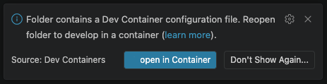

# CAP BTP University introduction

This repository contains a comprehensive Business Technology Platform (BTP) Cloud Application Programming (CAP) exercise designed for university training and educational purposes. It provides hands-on experience with SAP's modern development framework.

## Contents

This project includes the following key components:

- **LICENSE file**: Apache 2.0 license for open-source compliance
- **REUSE.toml file**: Configuration for the REUSE tool to ensure proper licensing and attribution
- **README.md file**: Project documentation and setup instructions
- **exercise.typ**: Project exercise as typ

For accessing the rendered components please visit the [Release section](https://github.com/SAP-samples/btp-cap-university-introduction/releases) of this repository.

## Getting started

1. Run VS Code and install the [DevContainer](vscode:extension/ms-vscode-remote.remote-containers) extension or with:
    ```bash
    code --install-extension ms-vscode-remote.remote-containers
    ```

1. Download `cap-university-introduction.zip` release from [Releases](https://github.com/SAP-samples/btp-cap-university-introduction/releases)
2. Unzip `cap-university-introduction.zip`
3. Open `cap-university-introduction` with the following command if installed:
    ```bash
    code ./cap-university-introduction
    ```

> [!NOTE] 
> On the bottom right corner, click on open in Container:
> 
> 

5. Happy coding! 🥳

## License

Copyright (c) 2026 SAP SE or an SAP affiliate company. All rights reserved. This project is licensed under the Apache Software License, version 2.0 except as noted otherwise in the [LICENSE](LICENSE) file.
